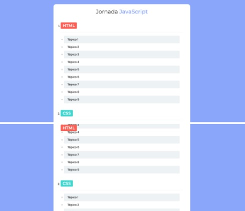

# Santander Coders 2023  - Trilha Web Front End
Repositório para guardar os exercícios e desafios da Fase II da Trilha Web Front End do programa Santander Coders 2023 em parceria com a ADA.

| :placard: Vitrine.Dev |     |
| -------------  | --- |
| :sparkles: Nome        | **Santander Coders 2023**
| :label: Tecnologias | html, css, javascript
| :rocket: URL         | https://enyus.github.io/santandercoders23/
| :fire: Desafio     | TODO

<!-- Inserir imagem com a #vitrinedev ao final do link -->

## Detalhes do projeto
Fui selecionado para a segunda fase do programa Santander Coders, que me deu acesso aos cursos introdutórios, ministrados pela <a href="https://ada.tech/sou-aluno">ADA</a>, de Git e Versionamento, HTML, CSS, Javascript e React. Após finalizar as aulas, nos é sugerido realizar alguns exercícios que puderam ser encontrados na <a href="https://discord.com/invite/DgHqnPJc7Y">comunidade no Discord da Let´s Code</a>. Como já estou um pouco familiarizado com essas tecnologias, resolvi criar esse repositório para guardar tais exercícios.

### Conteúdo
| <a href="#exercícios-html-">Exercícios de HTML</a> | <a href="#exercícios-css-">Exercícios de CSS</a> | <a href="#exercícios-javascript-">Exercícios de JavaScript</a> |

## Exercícios HTML 🧱
1. Código HTML que use apenas parágrafos e quebra de linhas (sem usar ` `). <a href="https://enyus.github.io/santandercoders23/html/exercicio1.html">Veja a resolução aqui.</a>
2. Crie um código HTML com 2 imagens das linguagens de programação que você gosta e adicionar favicons. <a href="https://enyus.github.io/santandercoders23/html/exercicio2.html">Veja a resolução aqui.</a>
3. Você deverá criar um código HTML com várias imagens, parágrafos, favicons e quebras de linhas das linguagens de programação que você gosta. <a href="https://enyus.github.io/santandercoders23/html/exercicio3.html">Veja a resolução aqui.</a>
4. Você deverá criar um código HTML com vários emojis de sua preferência. <a href="https://enyus.github.io/santandercoders23/html/exercicio4.html">Veja a resolução aqui.</a>
5. Você deverá criar um código HTML que contenha uma foto sua e uma breve descrição da sua atuação profissional. Como bônus, pode adicionar links para suas redes sociais ou GitHub. <a href="https://enyus.github.io/santandercoders23/html/exercicio5.html">Veja a resolução aqui.</a>
6. Você deverá criar um código HTML que contenha links para outras páginas HTML do seu projeto,e links para páginas da web. <a href="https://enyus.github.io/santandercoders23/html/exercicio6.html">Veja a resolução aqui.</a>
7. Agora, você deve criar um formulário HTML de cadastro de pessoas em uma loja virtual. Nesse formulário, você deve solicitar as seguintes informações ao usuário: 
  ● Nome 
  ● E-mail 
  ● CPF 
  ◠Gênero 
  ● Data de Nascimento 
  ● Telefone 
  ◠Quer ou não receber notificações por WhatsApp 
  ◠Quer ou não receber ofertas por e-mail 
  <a href="https://enyus.github.io/santandercoders23/html/exercicio7.html">Veja a resolução aqui.</a>
8. Crie um código HTML que contenha uma tabela com o mesmo conteúdo contido na tabela presente <a href="https://www.fdic.gov/resources/resolutions/bank-failures/failed-bank-list/">neste link</a>.  <a href="https://enyus.github.io/santandercoders23/html/exercicio8.html">Veja a resolução aqui.</a>
9. Reproduza a tabela ilustrada pela imagem <a href="https://k12digitalcourses.com/wp-content/uploads/2018/07/tableexample.png">deste link</a> utilizando um código HTML.  <a href="https://enyus.github.io/santandercoders23/html/exercicio9.html">Veja a resolução aqui.</a>
10. Você deverá criar um código HTML que contenha listas ordenadas e listas não ordenadas. Além disso, aproveite para utilizar listas não ordenadas para criar uma barra de navegação na sua página. <a href="https://enyus.github.io/santandercoders23/html/exercicio10.html">Veja a resolução aqui.</a>

### &#128293; Desafio HTML &#128293;
Você deverá criar um código HTML que contenha um portfólio de apresentação de você como desenvolvedor. Esse portfólio deverá conter uma foto sua, redes sociais para contato, descrição das suas experiências, somente utilizando HTML. Ao final, colocar o portfólio no GitHub Pages.
 <a href="https://enyus.github.io/santandercoders23/html/desafio.html">Veja a resolução aqui.</a>

### <a href="#">Voltar ao topo</a>

## Exercícios CSS 🎨
1. Você deverá criar um código HTML com CSS que contenha texto e no body seja Verdana, tamanho Médio, preto, com fundo amarelo e sem margens. Faça todas as fontes de título Georgia, e faça Heading 1 xx-large e cardinal red. <a href="https://enyus.github.io/santandercoders23/css/exercicio1.html">Veja a resolução aqui.</a>
2. Você deverá criar um código HTML com CSS que contenha texto e crie uma classe chamada renda e torne-a uma cor de fundo de #0ff. Crie uma classe chamada despesas e faça com que a cor de fundo seja #f0f. Crie uma classe chamada lucro e torne-a uma cor de fundo de #f00. Ao longo do documento, qualquer texto que menciona receitas, despesas ou lucros, anexou a classe apropriada a esse pedaço de texto. <a href="https://enyus.github.io/santandercoders23/css/exercicio2.html">Veja a resolução aqui.</a>
3. Você deverá criar um código HTML com CSS para alterar a tag li para ter as seguintes propriedades: 
  ◠Um status de exibição de inline  
  ◠Uma borda preta média com duas linhas  
  ● Nenhum tipo de estilo de lista  
   <a href="https://enyus.github.io/santandercoders23/css/exercicio3.html">Veja a resolução aqui.</a>
4. Você deverá criar um código HTML com CSS para adicionar as seguintes propriedades no estilo da tag li: 
  ● Margem de 5px;  
  ● Preenchimento de 10px para cima, 20px para a direita, 10px para baixo e 20px para a esquerda. 
   <a href="https://enyus.github.io/santandercoders23/css/exercicio4.html">Veja a resolução aqui.</a>
5. Você deverá criar um código HTML com CSS para adicionar uma regra avançada de p:first-letter e crie as seguintes propriedades para esta regra: 
  ● Tamanho da fonte de 36px  
  ● Peso da fonte em negrito  
   <a href="https://enyus.github.io/santandercoders23/css/exercicio5.html">Veja a resolução aqui.</a>
6. Estilize a página de um sumário para se assemelhar ao modelo abaixo. Atente para os requisitos principais: 
  ◠As cores de fundo dos tópicos devem se alternar entre a cor definida por --separator-color e #fff 
  ◠Utilize variáveis do CSS para colorir as tags de tecnologias e garanta que o 1o e 6o elementos tenham a cor definida na --tag-color-1, 2o e 7o com a --tag-color-2, 3o e 8o com a --tag-color-3 e assim por diante 
  ◠Garanta que a tag de tecnologia numerada fique fixa ao fazer scroll até encontrar a próxima (dica: use display sticky) 
  
  <a href="https://enyus.github.io/santandercoders23/css/exercicio6.html">Veja a resolução aqui.</a>
 7. Adicione regras nos locais indicados do arquivo styles.css para fazer uma visualização em lista, cards ou destaques segundo as imagens abaixo:
 
  ◠A visualização de lista deve ter apenas um item por linha e os itens devem ter espaçamento vertical de 2rem; 
  ◠A visualização de cards deve ter 3 cards por linha de mesmo tamanho e os itens devem ter espaçamento horizontal e vertical de 5rem; 
  ◠A visualização de destaques deve ter o primeiro e sexto elementos com tamanho maior até 4 vezes maior em relação a cards da mesma linha e os itens devem ter espaçamento horizontal e vertical de 5rem. 
  <a href="https://enyus.github.io/santandercoders23/css/exercicio7.html">Veja a resolução aqui.</a>
 8. Faça o layout mobile para a página da loja do exercício 7 da seguinte forma: 
  ◠Permita que apenas sejam selecionados os modos de visualização de cards e lista 
  ◠Na visão de cards devem ter 2 cards por linha 
  ◠Garanta que os botões para troca de visualização apareçam fixos no topo da tela com position fixed ou sticky 
9. Adicione apenas uma propriedade grid-template-areas na classe react-card sem fazer mais nenhuma modificação para deixar o layout similar à imagem abaixo:

10. Faça um overlay para esmaecer a imagem de capa abaixo, utilizando apenas 2 pseudo elementos para isso (::after e ::before), da seguinte forma: 
  ● Overlay no ::before com fundo #000, opacidade 0.6 e cobrindo toda a imagem de capa 
  ◠Texto no ::after de cor #fff sem ser afetado pelo overlay, com conteúdo "O mundo como você nunca viu", largura máxima de 30rem, tamanho de 8rem, altura de linha 7rem e posicionado à 3rem da borda esquerda sobre o overlay e imagem. 
  ◠Faça uma animação para que o ícone da seta se desloque para baixo em 0.5rem e retorne para a posição inicial após 2 segundos 

### &#128293; Desafio CSS &#128293;
Você deverá criar um código HTML com CSS que contenha um portfólio de apresentação seu, como desenvolvedor. Esse portfólio deverá conter uma foto sua, redes sociais para contato e descrição das suas experiências, tudo utilizando somente HTML e CSS. Ao final, coloque o portfólio no GitHub Pages.

### <a href="#">Voltar ao topo</a>

## Exercícios Javascript 🧠
1. Faça um programa que peça a temperatura em graus Fahrenheit (°F), transforme e mostre a temperatura em graus Celsius (°C).
2. Faça um programa que leia as coordenadas de 2 (dois) pontos em um plano cartesiano 2D: a coordenada x do primeiro ponto (x_1), a coordenada y do primeiro ponto (y_1), a coordenada x do segundo ponto (x_2) e a coordenada y do segundo ponto (y_2). Em seguida, calcule a distância euclidiana entre os pontos.
3. Crie um programa que leia um valor qualquer e apresente uma mensagem dizendo em qual dos seguintes intervalos ([0,25], (25,50], (50,75], (75,100]) este valor se encontra. Caso o valor não esteja em nenhum destes intervalos, deverá ser impressa a mensagem “Fora de intervalo”.
4. Crie o jogo “Pedra, Papel, Tesoura” por meio de um código em JavaScript. Para isso, solicite que o primeiro jogador informe a sua escolha e depois o mesmo para o segundo jogador. Por fim, utilize os if’s para saber quem seria o vencedor.
5. Faça um programa, usando loops, que peça para o usuário digitar vários números, um após outro, e que só finaliza quando o usuário digitar 0. Ao final imprima a soma de todos os números digitados.
6. Faça um programa que imprima a tabuada do 9 (de 9 x 1 a 9 x 10) usando loops.
7. Crie uma função que recebe o valor do raio de um círculo como parâmetro e retorna o valor da área desse círculo.
8. Faça um programa que dados dois arrays de mesmo tamanho, imprima o produto escalar entre eles.
9. Vamos fazer um programa para verificar quem é o assassino de um crime. Para descobrir o assassino, a polícia faz um pequeno questionário com 5 perguntas onde a resposta só pode ser sim ou não: 
  9.1. Mora perto da vítima? 
  9.2. Já trabalhou com a vítima? 
  9.3. Telefonou para a vítima? 
  9.4. Esteve no local do crime? 
  9.5. Devia para a vítima? 
Cada resposta “sim” dá um ponto para o suspeito. A polícia considera que os suspeitos com 5 pontos são os assassinos, com 4 a 3 pontos são cúmplices e 2 pontos são apenas suspeitos, necessitando de outras investigações. Valores abaixo de 2 são liberados. No seu programa, você deve fazer essas perguntas e, de acordo com as respostas do usuário, informar como a polícia o considera.
10. Faça um programa que fique pedindo uma resposta do usuário, entre 1, 2 e 3. Se o usuário digitar 1, o programa deve cadastrar um novo usuário, solicitando nome, idade, e-mail e CPF, guardando esse cadastro em um objeto, e cada objeto devo ser adicionado em um array. Quando o usuário digitar 2, o programa deve imprimir os usuários cadastrados; e se o usuário digitar 3, o programa deve encerrar.

### &#128293; Desafio JavaScript &#128293;
Você já deve ter jogado o Jogo da Forca, certo? O que você acha de desenvolver o seu próprio Jogo da Forca em JavaScript? Esse será o seu desafio!
Para te ajudar com isso, vamos te passar algumas diretrizes para que você tenha uma noção clara de como o jogo deve funcionar e de quais etapas você deve seguir para atingir esse resultado. Vamos lá!

1. No início do código, você pode solicitar o nome do jogador. Assim, você pode imprimir uma mensagem de boas-vindas. Talvez até imprimir uma mensagem explicando como o jogo funciona. Porém, uma sugestão é deixar tudo isso para o final, porque assim você pode focar, inicialmente, no funcionamento do jogo, em si.
2. Você vai precisar definir uma palavra para o jogador descobrir, certo? Na primeira versão do seu código, coloque uma palavra fixa, como "banana", por exemplo. Em uma segunda versão, você pode criar um array com várias palavras e, no início do programa, sortear uma delas. Veja a seção Dicas, ao final deste material, para saber como você poderia fazer esse sorteio.
3. Escolhida uma palavra para o jogador descobrir, você já pode mostrar para ele quantas letras a palavra tem. Também vai ser importante ter uma outra variável que consiste na palavra que o jogador está tentando acertar. 
  3.1. Para isso, nossa sugestão é que você crie um array que inicia com vários ‘_’ , sendo o número de _ igual ao número de caracteres da palavra que ele precisa descobrir. 
  3.2. Por exemplo, se a palavra for "banana", você deve um array com o seguinte conteúdo: ['_', '_', '_', '_', '_', '_']. Observe que temos 6 caracteres. 
  3.3. Esse array vai ser importante para que você possa mostrar ao usuário o “formato†da palavra e, a medida que ele for acertando as letras, você coloca a letra dentro do array, na posição correta, o que vai facilitar a visualização/identificação da palavra. 
4. A partir daí o jogo começa, ou seja, você irá pedir que o usuário informe uma letra repetidas vezes, até que ele erre 6 vezes (pela regra tradicional do jogo da forca) ou acerte todas as letras da palavra. Observe que isso corresponde a uma estrutura de repetição.
5. Lembre-se que, ao término dessa repetição, você deve mostrar que o usuário perdeu, caso ele tenha errado 6 vezes; ou que ele acertou a palavra, caso ele a tenha completado. Além disso, é importante que você informe, em todo caso, qual era a palavra a ser descoberta.

### <a href="#">Voltar ao topo</a>
