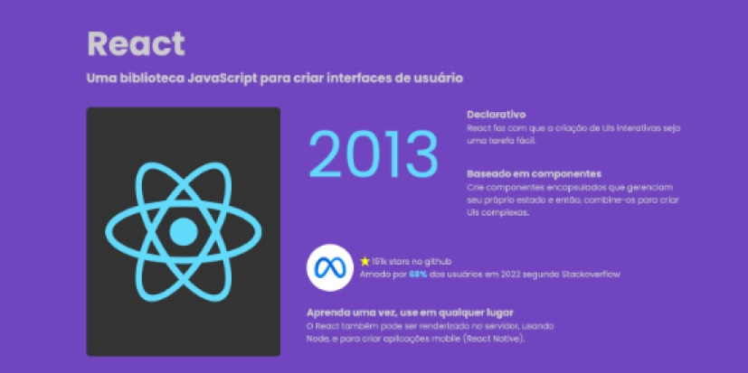
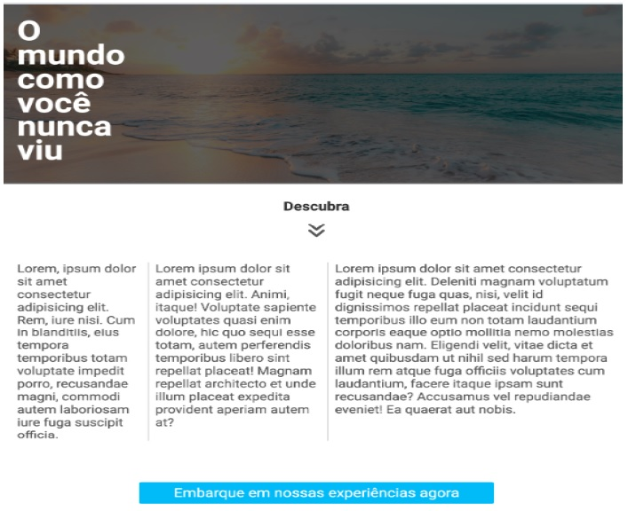

# Santander Coders 2023  - Trilha Web Front End
Repositório para guardar os exercícios e desafios da Fase II da Trilha Web Front End do programa Santander Coders 2023 em parceria com a ADA.

| :placard: Vitrine.Dev |     |
| -------------  | --- |
| :sparkles: Nome        | **Santander Coders 2023**
| :label: Tecnologias | html, css, javascript
| :rocket: URL         | https://enyus.github.io/santandercoders23/
| :fire: Desafio     | TODO

<!-- Inserir imagem com a #vitrinedev ao final do link -->

## Detalhes do projeto
Fui selecionado para a segunda fase do programa Santander Coders, que me deu acesso aos cursos introdutórios, ministrados pela <a href="https://ada.tech/sou-aluno">ADA</a>, de Git e Versionamento, HTML, CSS, Javascript e React. Após finalizar as aulas, nos é sugerido realizar alguns exercícios que puderam ser encontrados na <a href="https://discord.com/invite/DgHqnPJc7Y">comunidade no Discord da Let´s Code</a>. Como já estou um pouco familiarizado com essas tecnologias, resolvi criar esse repositório para guardar tais exercícios.

### Conteúdo
| <a href="#exercícios-html-">Exercícios de HTML</a> | <a href="#exercícios-css-">Exercícios de CSS</a> | <a href="#exercícios-javascript-">Exercícios de JavaScript</a> |

## Exercícios HTML 🧱
1. Código HTML que use apenas parágrafos e quebra de linhas (sem usar ` `). <a href="https://enyus.github.io/santandercoders23/html/exercicio1.html">Veja a resolução aqui.</a>
2. Crie um código HTML com 2 imagens das linguagens de programação que você gosta e adicionar favicons. <a href="https://enyus.github.io/santandercoders23/html/exercicio2.html">Veja a resolução aqui.</a>
3. Você deverá criar um código HTML com várias imagens, parágrafos, favicons e quebras de linhas das linguagens de programação que você gosta.<a href="https://enyus.github.io/santandercoders23/html/exercicio3.html">Veja a resolução aqui.</a>
4. Você deverá criar um código HTML com vários emojis de sua preferência.
5. Você deverá criar um código HTML que contenha uma foto sua e uma breve descrição da sua atuação profissional. Como bônus, pode adicionar links para suas redes sociais ou GitHub.
6. Você deverá criar um código HTML que contenha links para outras páginas HTML do seu projeto,e links para páginas da web.
7. Agora, você deve criar um formulário HTML de cadastro de pessoas em uma loja virtual. Nesse formulário, você deve solicitar as seguintes informações ao usuário: 
  ● Nome 
  ● E-mail 
  ● CPF 
  ◠Gênero 
  ● Data de Nascimento 
  ● Telefone 
  ◠Quer ou não receber notificações por WhatsApp 
  ● Quer ou não receber ofertas por e-mail
8. Crie um código HTML que contenha uma tabela com o mesmo conteúdo contido na tabela presente <a href="https://www.fdic.gov/resources/resolutions/bank-failures/failed-bank-list/">neste link</a>.
9. Reproduza a tabela ilustrada pela imagem <a href="https://k12digitalcourses.com/wp-content/uploads/2018/07/tableexample.png">deste link</a> utilizando um código HTML.
10. Você deverá criar um código HTML que contenha listas ordenadas e listas não ordenadas. Além disso, aproveite para utilizar listas não ordenadas para criar uma barra de navegação na sua página.

### &#128293; Desafio HTML &#128293;
Você deverá criar um código HTML que contenha um portfólio de apresentação de você como desenvolvedor. Esse portfólio deverá conter uma foto sua, redes sociais para contato, descrição das suas experiências, somente utilizando HTML. Ao final, colocar o portfólio no GitHub Pages.

### <a href="#">Voltar ao topo</a>

## Exercícios CSS 🎨
1. Você deverá criar um código HTML com CSS que contenha texto e no body seja Verdana, tamanho Médio, preto, com fundo amarelo e sem margens. Faça todas as fontes de título Georgia, e faça Heading 1 xx-large e cardinal red.
2. Você deverá criar um código HTML com CSS que contenha texto e crie uma classe chamada renda e torne-a uma cor de fundo de #0ff. Crie uma classe chamada despesas e faça com que a cor de fundo seja #f0f. Crie uma classe chamada lucro e torne-a uma cor de fundo de #f00. Ao longo do documento, qualquer texto que menciona receitas, despesas ou lucros, anexou a classe apropriada a esse pedaço de texto.
3. Você deverá criar um código HTML com CSS para alterar a tag li para ter as seguintes propriedades:
  ◠Um status de exibição de inline  
  ◠Uma borda preta média com duas linhas  
  ● Nenhum tipo de estilo de lista  
4. Você deverá criar um código HTML com CSS para adicionar as seguintes propriedades no estilo da tag li:
  ● Margem de 5px;  
  ● Preenchimento de 10px para cima, 20px para a direita, 10px para baixo e 20px para a esquerda. 
5. Você deverá criar um código HTML com CSS para adicionar uma regra avançada de p:first-letter e crie as seguintes propriedades para esta regra:
  ● Tamanho da fonte de 36px  
  ● Peso da fonte em negrito  
6. Estilize a página de um sumário para se assemelhar ao modelo abaixo. Atente para os requisitos principais:
  ◠As cores de fundo dos tópicos devem se alternar entre a cor definida por --separator-color e #fff 
  ◠Utilize variáveis do CSS para colorir as tags de tecnologias e garanta que o 1o e 6o elementos tenham a cor definida na --tag-color-1, 2o e 7o com a --tag-color-2, 3o e 8o com a --tag-color-3 e assim por diante 
  ◠Garanta que a tag de tecnologia numerada fique fixa ao fazer scroll até encontrar a próxima (dica: use display sticky) 
 
 7. Adicione regras nos locais indicados do arquivo styles.css para fazer uma visualização em lista, cards ou destaques segundo as imagens abaixo:
 
  ◠A visualização de lista deve ter apenas um item por linha e os itens devem ter espaçamento vertical de 2rem; 
  ◠A visualização de cards deve ter 3 cards por linha de mesmo tamanho e os itens devem ter espaçamento horizontal e vertical de 5rem; 
  ◠A visualização de destaques deve ter o primeiro e sexto elementos com tamanho maior até 4 vezes maior em relação a cards da mesma linha e os itens devem ter espaçamento horizontal e vertical de 5rem. 
 8. Faça o layout mobile para a página da loja do exercício 7 da seguinte forma:
  ◠Permita que apenas sejam selecionados os modos de visualização de cards e lista 
  ◠Na visão de cards devem ter 2 cards por linha 
  ◠Garanta que os botões para troca de visualização apareçam fixos no topo da tela com position fixed ou sticky 
9. Adicione apenas uma propriedade grid-template-areas na classe react-card sem fazer mais nenhuma modificação para deixar o layout similar à imagem abaixo:

10. Faça um overlay para esmaecer a imagem de capa abaixo, utilizando apenas 2 pseudo elementos para isso (::after e ::before), da seguinte forma:
  ● Overlay no ::before com fundo #000, opacidade 0.6 e cobrindo toda a imagem de capa 
  ◠Texto no ::after de cor #fff sem ser afetado pelo overlay, com conteúdo "O mundo como você nunca viu", largura máxima de 30rem, tamanho de 8rem, altura de linha 7rem e posicionado à 3rem da borda esquerda sobre o overlay e imagem. 
  ◠Faça uma animação para que o ícone da seta se desloque para baixo em 0.5rem e retorne para a posição inicial após 2 segundos 

### &#128293; Desafio CSS &#128293;
Você deverá criar um código HTML com CSS que contenha um portfólio de apresentação seu, como desenvolvedor. Esse portfólio deverá conter uma foto sua, redes sociais para contato e descrição das suas experiências, tudo utilizando somente HTML e CSS. Ao final, coloque o portfólio no GitHub Pages.

### <a href="#">Voltar ao topo</a>

## Exercícios Javascript 🧠

### <a href="#">Voltar ao topo</a>
